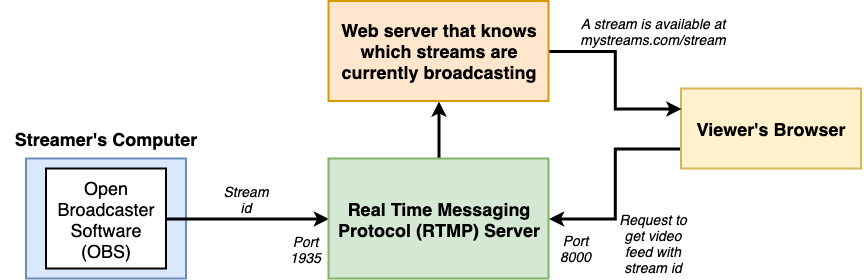
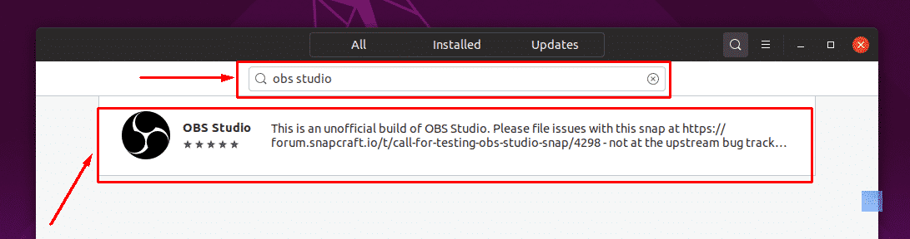

# stream-rtmp
Node Media Server package and c RTMP server ... DEMO:


--------------------------
### App Structure




--------------------------
##### REPOS:

[Client of Video Stream](https://github.com/tom2kota/stream-client)

[JSON server for stream-client](https://github.com/tom2kota/stream-server)

[Node Media Server package & RTMP Server](https://github.com/tom2kota/stream-rtmp)

--------------------------

##### DEMOS:

[Client of Video Stream](https://tom2kota.github.io/stream-client/)

[JSON server for stream-client](https://stream-json-server.herokuapp.com/)

[Node Media Server package & RTMP Server]()

--------------------------


#### Node-Media-Server

[npmjs](https://www.npmjs.com/package/node-media-server)

#### Install

npm version (recommended)

``` 
mkdir nms
cd nms
npm install node-media-server
vi app.js
```


``` 
const NodeMediaServer = require('node-media-server');
 
const config = {
  rtmp: {
    port: 1935,
    chunk_size: 60000,
    gop_cache: true,
    ping: 30,
    ping_timeout: 60
  },
  http: {
    port: 8000,
    allow_origin: '*'
  }
};
 
var nms = new NodeMediaServer(config)
nms.run();

```

``` 
node app.js
```

----------------


#### OBS Studio

[Open Broadcaster Software](https://obsproject.com/)

#### Linux Install Directions

[wiki docs](https://obsproject.com/wiki/)


   xserver-xorg version 1.18.4 or newer is recommended to avoid potential performance issues with certain features in OBS, such as the fullscreen projector.

   FFmpeg is required. If you do not have the FFmpeg installed (if you're not sure, then you probably don't have it), you can get it with the following commands:


```
sudo apt install ffmpeg
```

   Then you can install OBS with the following commands, make sure you enabled the multiverse repo in Ubuntu's software center (NOTE: On newer versions of ubuntu adding a repository automatically apt updates.):

``` 
sudo add-apt-repository ppa:obsproject/obs-studio
sudo apt update
sudo apt upgrade
sudo apt install obs-studio
```

   or
   
``` 
sudo snap install obs-studio
```
   
   Run OBS with the following command:

``` 
obs-studio
```

   or OBS Studio Ubuntu using Ubuntu Software-GUIs
   



###### Customize OBS Stream

```
SETTINGS => Stream

STREAM TYPE => Custom Streaming Server

URL => rtmp://localhost/live

STREAM KEY => 1 (for the stream with ID:1)

CLOSE SETTINGS

PRESS THE BUTTON => Start Streaming

```

RESULT: [http://localhost:3000/streams/1](http://localhost:3000/streams/1)


###### Run Node Media Server

```
node index.js
```

```
const NodeMediaServer = require('node-media-server');

const config = {
    rtmp: {
        port: 1935,
        chunk_size: 60000,
        gop_cache: true,
        ping: 30,
        ping_timeout: 60
    },
    http: {
        port: 8000,
        allow_origin: '*'
    }
};

var nms = new NodeMediaServer(config)
nms.run();
```

Node Media Server v2.1.9

Node Media Rtmp Server started on port: 1935

Node Media Http Server started on port: 8000

Node Media WebSocket Server started on port: 8000


### Deploy

Heroku support says that they only allow 80 and 443 HTTP/S ports and they do not officially support RTMP. 

- I'm probably going to opt for Docker + AWS

- https://vercel.com/

- 


------------

#### references

[Разработка приложения для потокового вещания с помощью Node.js и React](https://habr.com/ru/company/ruvds/blog/457860/)
